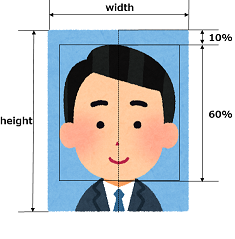

# PhotoCropping

## 顔認識による証明写真の切り抜き

写真から認識した顔の高さ（髪の毛の上から顎まで）をもとに、写真を切り抜くUiPathのワークフローです。社員証のための写真加工を想定しています。

## 設定

Data¥Condig.xlsxのSettingsタブで以下の設定ができます。

| Name                | Default     | Description            |
| ------------------- | ----------- | ---------------------- |
| OriginalPhotoFolder | Data\Input  | 加工前の写真のフォルダ |
| CroppedPhotoFolder  | Data\Output | 加工後の写真のフォルダ |
| Width               | 180         | 切り抜く写真の幅       |
| Height              | 225         | 切り抜く写真の高さ     |
| Scale               | 20          | 切り抜きのための調整値（後述） |

切り抜くエリアは、顔の高さが写真の高さの60%、顔の上に10%の空きとなるよう調整します。ただし、利用している顔認識システム（OpenCV）では、髪の毛を含めた顔を認識する識別器がないので、Scaleで指定した割合が髪の毛の部分と想定して切り抜きます。

## embeddable python

写真の切り抜きは、Python + OpenCVで実装しています。利用にあたっては、python-3.6.6-embed-win32フォルダに下記の手順で作成したembeddable pythonをコピーしてください。

1. embeddable pythonのダウンロード
  * https://www.python.org/downloads/windows/ から Windows x86 embeddable zip file をダウンロードし、解凍します。UiPathのPython Activityが認識するバージョンを選択してください。
  テストはPython 3.6.6で行いました。

2. pipの導入
  * pythonNN._pthファイルのの"import site"をuncommentします。
  * https://bootstrap.pypa.io/get-pip.py からget-pip.pyをダウンロードします。
  * python get-pip.py　を実行します。

3. OpenCVを導入
  * python -m pip install opencv_python を実行します。
